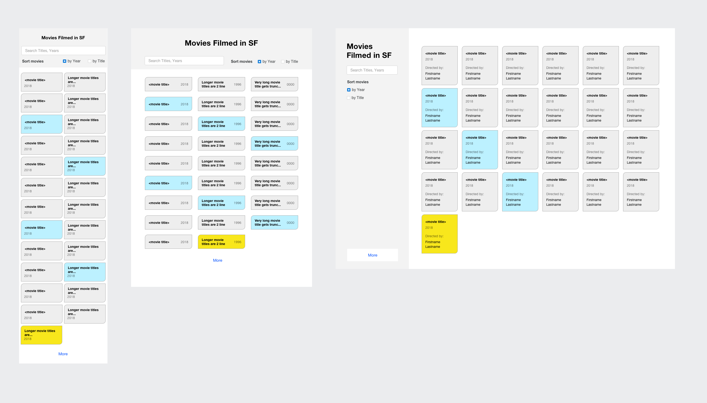
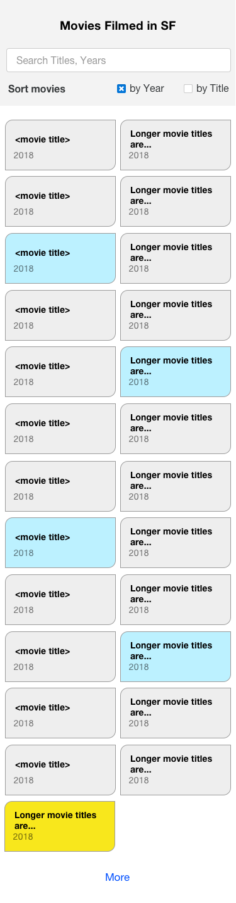
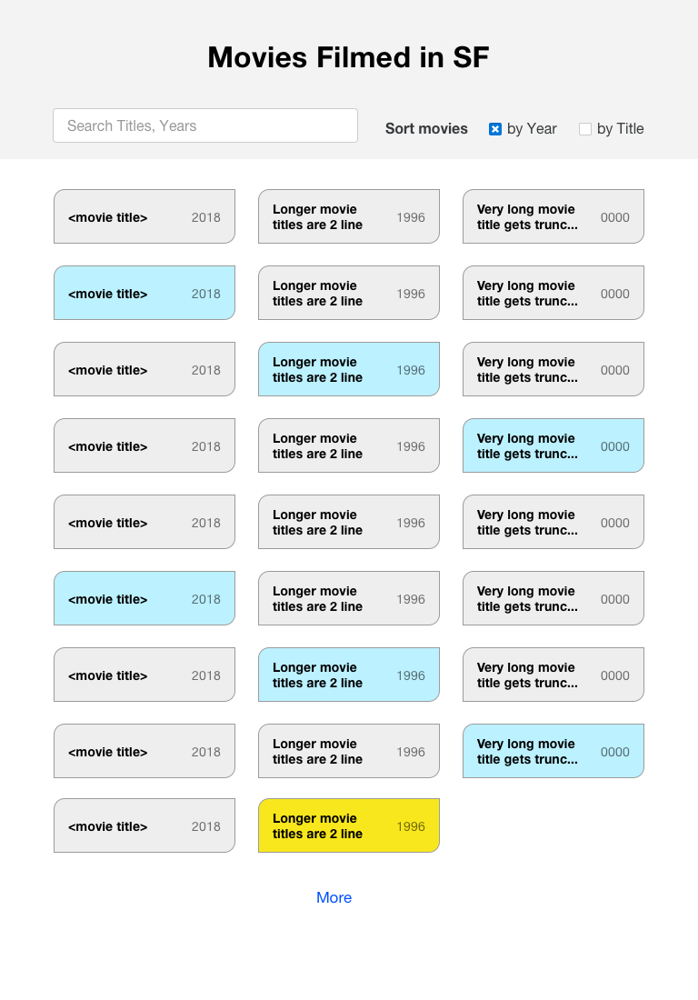
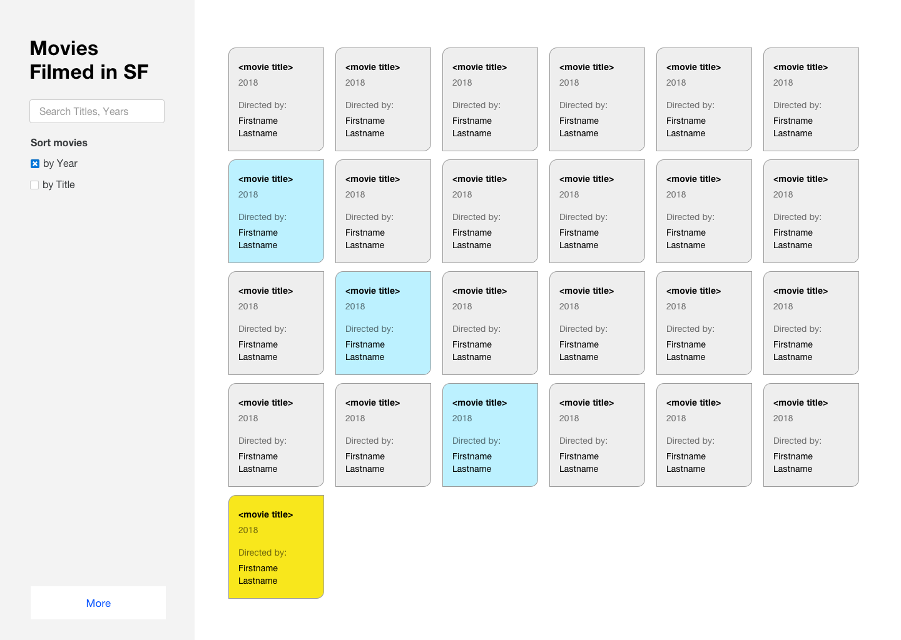

# Kinsa Health Coding Challenge

> A responsive [Vue](https://vuejs.org/) application displaying the locations in San Francisco where movies and television shows have been filmed.

## Build Setup

``` bash
# install dependencies
npm install

# serve with hot reload at localhost:8080
npm run dev

# build for production with minification
npm run build
```

For detailed explanation on how things work, consult the [docs for vue-loader](http://vuejs.github.io/vue-loader).

### Development Notes

The [webpack-simple](https://github.com/vuejs-templates/webpack-simple) template was used to produce the basic structure and configure `webpack.config.js`.

### Kinsa Health Prompt

Web Developer Coding Test

Build a responsive and cross-browser web app to display the locations where movies were filmed in San Francisco (See ZIP for screen designs).

The app must be constructed using HTML, CSS, and JavaScript. You are free to use any framework or libraries you choose.

Provide for searching or filtering by “Movie Title” or “Release Year” and paging through the data 25 records at a time.

The sorted & filtered Movie data should be displayed in a scrollable presentation that allows the data to be sorted. See the attachment for design requirements.

Please provide source code (ideally in git) and a link to a running demo or instructions on how to run your app.

Bonus Features:
	* Allow for sorting by all fields
	* Link to Google (or other) map displaying the location

Data Source: https://data.sfgov.org/Culture-and-Recreation/Film-Locations-in-San-Francisco/yitu-d5am

API End Point: https://data.sfgov.org/resource/wwmu-gmzc.json

Documentation: https://dev.socrata.com/foundry/data.sfgov.org/wwmu-gmzc





